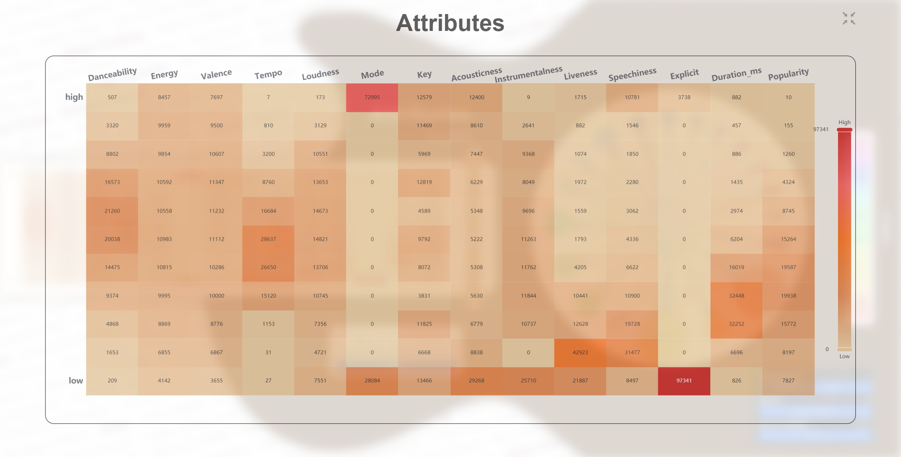
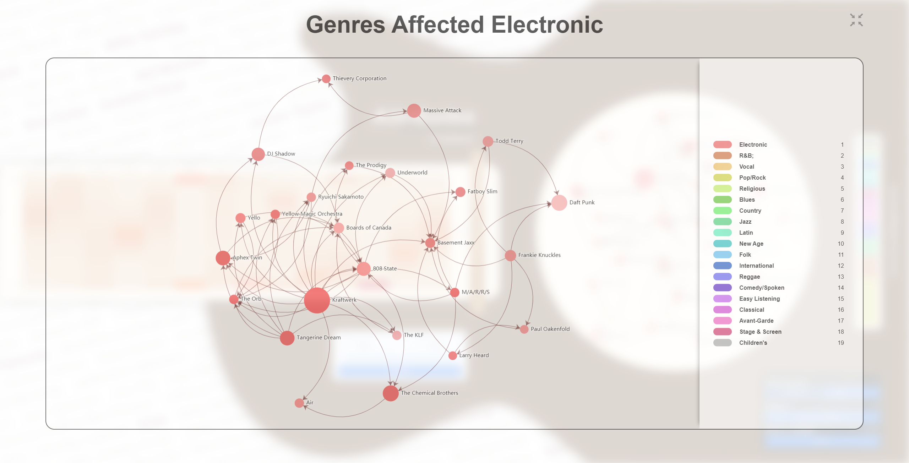

# 音乐演进可视化项目说明文档

贺梓淇 姜冠宇 应宇欣 曾博涵

## 总览

音乐自始至终都是人类的文化财富，对于音乐文化的分析与研究是很有价值的一项工作。

本组就过去百年间众多流派中著名音乐家及其重要作品的特性与联系进行了可视化分析，以互相关联的热力图、关系图的方式呈现了可视化的效果。

你可以在 https://apassbydreg.github.io/MusicEvolutionVis/ 查看本项目的结果

## 各部分说明

### 属性表部分

该部分利用热力图的形式展现了音乐作品的属性分布，通过将不同数据进行归一化操作来提取出每个属性的分布特征。其中图中的横轴表示了音乐作品的13个不同属性，包括：

+ 律动(Danceability)
+ 能量（Energy)
+ 情绪积极性（Valence）
+ 节奏（Tempo）
+ 音量（Loudness）
+ 重复程度（Mode）
+ 主调（Key）
+ 非电子音程度（Acousticness）
+ 纯音乐程度（Instrumentalness）
+ 现场程度（Liveness）
+ 朗诵程度（Speechiness）
+ 清晰程度（Explicit）
+ 时长（Duration_ms）
+ 受欢迎程度（Popularity）

图表的纵轴则为每个属性的程度，从上到下依次为从高到低均匀分布。

除了各个属性的分布视图外用户还可以点击具体的某个属性查看该属性的随时间变化趋势。此时图表的横轴转变为时间，从左到右增加；纵轴仍旧保持不变。

### 关系图部分

为了展示不同音乐流派、不同音乐家间的影响力、影响关系，我们设计了关系图来满足这一需求。具体实现时，根据需求设计了三种视图：
+ 音乐流派视图：该视图会根据所选时间范围内，各个音乐流派的影响力大小、流派间影响关系，使用环形布局关系图对数据进行展示
+ 音乐家视图：该视图会根据所选时间范围内的音乐家数据，选取指定流派内，影响力最大的一批音乐家，使用力导向关系图进行展示
+ 中心音乐家视图：该视图在用户对特定音乐家感兴趣时，提供了便捷的视图来展示以该音乐家作为中心，与之具有影响关系的两层以内的音乐家数据
三种视图之间，可以通过节点点击、重置按键、弹幕点击等多种方式进行交互和跳转，同时可以配合其他组件的操作，限定数据的时间范围、流派范围，向用户展示多个维度的信息。

### 比例尺部分
作为属性表与关系图的补充，我们设计了流派比例尺来显示不同状态下音乐流派的比例。在实现中使用了条形图，主要分为三种情况：
+ 未选中流派或音乐家：此时本部分会根据各个年份不同流派的音乐比例数据进行绘制
+ 当选中流派未选中音乐家：此时本部分会显示在当前时间下选中流派受到哪些流派的影响
+ 当选中音乐家时：此时本部分会显示在当前时间下选中音乐家受到哪些流派的影响

此外，点击比例尺中的各个模块，会跳转到选中对应流派时的情况。

### 弹幕部分

为了更加精确地定位到指定的音乐家，我们设计了音乐家背景弹幕来满足这一需求。在实现中，影响力最大的 1000 位音乐家将以弹幕形式在背景持续滚动，而其中影响力最大的约 30% 的音乐家则会被高亮颜色突出，便于识别。当鼠标点击其中任意一位音乐家时，图例将被切换为音乐家中心模式，表格也会被切换为对应的流派的属性表格。

### 设置项部分

我们设计了多种设置项供用户筛选展示不同的内容，包括了重置按钮、表例状态选择器、流派筛选器以及年份范围选择器。为了方便用户进行观察分析，我们还提供了基于年份选择器的时间动画以及图表内容全屏功能。

## 可视化结果分析

### 属性表部分

音乐属性表是本作品中相当关键的一环，其主要展示了不同情况下的属性变化，可以非常直观地了解不同时代下人们偏好的音乐风格是怎样的。

### 关系图部分

音乐关系网是本作品中另一个比较关键的部分，其直观地展示了具体流派与音乐家之间的影响关系。

### 比例尺部分

流派比例尺是音乐关系网的一个附属部分，主要是为了方便用户观察不同情况下这些流派的影响情况。

### 弹幕部分

音乐家弹幕主要是实现了一个美观而简易的词云，同时方便用户更加直接地定位到相关的音乐家。

### 总体分析

结合“音乐属性表”所展示的音乐风格属性与“音乐关系网”以及“流派比例条”所展示的流派信息，我们能更加直观地看到不同流派互动下的音乐有怎样的风格。同时也可以看到不同时代下，人们更喜欢哪些流派的音乐风格。
